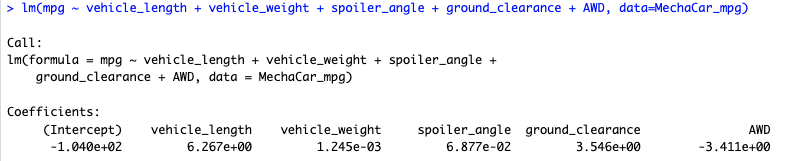
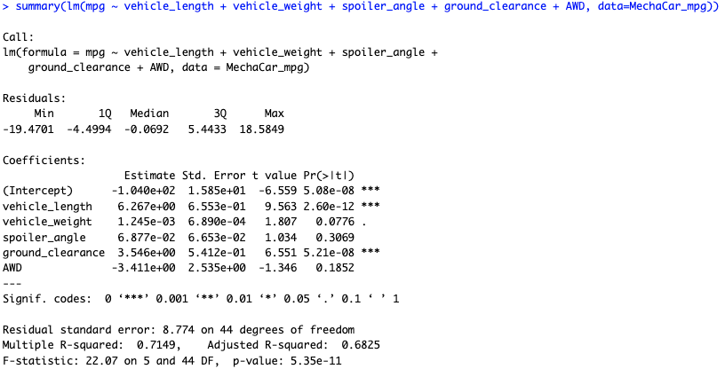
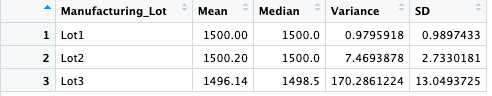
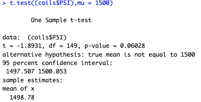
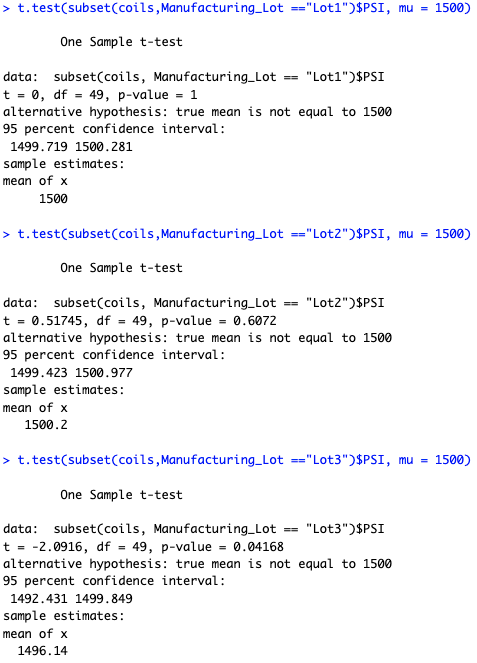

# MechaCar_Statistical_Analysis

## Deliverable 1: Linear Regression to Predict MPG

1.  Which variables/coefficients provided a non-random amount of variance to the mpg values in the dataset?
    -   Based on the data, the Vehicle_length and ground_clearance provided a non-random amount of variance which would impact MPG values.

    -   
2.  Is the slope of the linear model considered to be zero? Why or why not?
    -   The data shows that the p-value = 5.35e-11 which would be less than zero.

    -   
3.  Does this linear model predict mpg of MechaCar prototypes effectively? Why or why not?
    -   The data modeling above shows that the r-squared value is 0.7149, which means that the model predicts the mpg of MechaCar 71% of the time. While 71% is effective, further tests should be run to create a higher success rate of the data.

## Deliverable 2: Create Visualizations for the Trip Analysis

The design specifications for the MechaCar suspension coils dictate that the variance of the suspension coils must not exceed 100 pounds per square inch. Does the current manufacturing data meet this design specification for all manufacturing lots in total and each lot individually? Why or why not?

-   Based on the total_summary below, the variance of the suspension does not exceed 100 psi

-   

    

    

-   When we look at the lot_summary, we find that lots 1&2 meet the criteria and lot 3 exceeds the criteria by exceeding 100psi.

-   

## Deliverable 3: T-Tests on Suspension Coils

For this deliverable, we performed t-tests to determine if all manufacturing lots and each lot individually are statistically different from the population mean of 1,500 pounds per square inch.

Based on the above, as a whole, the lots show a mean of 1498.78 which under performs the standard of 1,500psi.

When we break down each lot individually, we are able to determine that lots 1 and 2 meet the population mean of 1,500 psi. Lot 3 has a mean of 1496.14 which is below the population mean of 1500psi. Lot 3 should be reviewed for quality control.

## Deliverable 4: Design a Study Comparing the MechaCar to the Competition

Consumers in search of a new car expect metrics that can be easily compared against various manufacturers and vehicle models. As gas prices continue to be unstable, MPG city/highway is a primary concern for many drivers. Also to be considered would be the passenger capacity, safety rating, dependability(maintenance), drive type(AWD, FWD, RWD 4WD) and horsepower. Using the ANOVA statistical test, we can focus on the categories listed above across the various vehicles.

A null hypothesis would be that the MechaCar performs as well if not better than the competition in the identified categories

The alternative hypothesis is that the MechCar under performs against its competitors.

The data necessary would include specifications from all vehicles in the same class as MechaCar based on the identified categories above.
